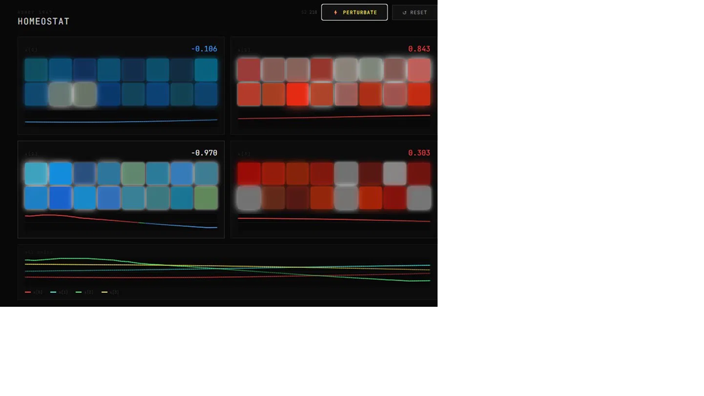

# Homeostat i and [Homeostat ii -- Distributed Units](distributed/README.md) 

A physical recreation of W. Ross Ashby's homeostat (1947), running on an ESP32-S3 Supermini with four WS2812 LED strips.

Built by Sui and Thomas for educational and illustrative purposes - to make Ashby's ideas about ultrastability visible, tangible, and alive.

---


## Live Demo - Visualiser

[](https://sui001.github.io/homeostat/visualiser/)
---

## What is the homeostat?

In 1947, the British psychiatrist W. Ross Ashby built a machine he called the homeostat. It was one of the first devices designed to model biological homeostasis - the capacity of living systems to maintain stability in the face of disturbance.

What made it remarkable was what it did *not* have. No goal. No memory. No intelligence. Just four coupled units influencing each other through a matrix of electrical connections, and a mechanism (the uniselector) that randomly reconfigured those connections whenever the system went out of range.

It kept trying random organisations until it found one that kept it alive.

Ashby called this **ultrastability**: not the stability of a fixed state, but the stability of the *capacity to find stability*. The system didn't know what equilibrium was. It just kept changing its relations until it stopped failing.

This build makes that process visible.

---

## How it works

**S1 -- the dynamical system**

Four coupled differential equations run continuously:

```
dx_i/dt = sum_j( k[i][j] * x[j] ) + disturbance
```

Four state variables x[0] through x[3] influence each other through a 4x4 matrix of coupling coefficients k. The system may be stable (all variables stay bounded) or unstable (variables drift out of range).

**S2 -- the uniselector**

When any x[i] exceeds the viable range (BOUND), S2 randomly reassigns that unit's row of k coefficients. It does this one unit at a time, and keeps going until the system finds a configuration whose dynamics bring all variables back within range.

Crucially: x[i] is not reset to zero on reconfiguration. The system must recover through its new dynamics. It heals by changing the relations among its parts, not by erasing the disturbance.

**The disturbance**

A momentary button press delivers a random-strength knock to x[0]. This propagates through the coupling matrix to all four units, throwing the system into visible oscillation and hunting behaviour.

---

## What you see

| Visual | Meaning |
|---|---|
| 4 green LEDs per strip | x[i] at rest, near zero - healthy |
| LEDs dropping out | x[i] moving away from zero - stressed |
| Red | x[i] positive |
| Blue | x[i] negative |
| Yellow flash (all 16) | Button knocked - disturbance entering |
| White flash (one strip) | That unit just reconfigured its connections |

Open Serial Plotter at 115200 to watch all four x variables as live scrolling lines - the closest thing to Ashby's original needles.

---

## Hardware

| Component | Detail |
|---|---|
| MCU | ESP32-S3 Supermini |
| LEDs | 4x WS2812 strips, 4 LEDs each |
| Input | Momentary push button |
| LED power | External 5V supply recommended |

## Wiring

| GPIO | Connection |
|---|---|
| 4 | Strip 1 data (x[0]) |
| 5 | Strip 2 data (x[1]) |
| 6 | Strip 3 data (x[2]) |
| 7 | Strip 4 data (x[3]) |
| 9 | Button -> GND (internal pullup, no resistor needed) |

---

## Libraries

- **FastLED** - via Arduino Library Manager

## Arduino IDE settings

- Board: ESP32S3 Dev Module (or ESP32-S3 Supermini)
- USB Mode: Hardware CDC and JTAG
- Baud: 115200

---

## Firmware versions

| File | Description |
|---|---|
| `homeostat_v3_final.ino` | Tuned and confirmed working |
| `homeostat_v3_1.ino` | Adds no-reset on reconfig + variable diagonal damping |

---

## Tuning parameters

```cpp
const float BOUND                    = 1.0f;   // viable range - triggers S2
const float DT                       = 0.06f;  // integration timestep
const float K_MAX                    = 0.35f;  // off-diagonal coupling strength
const float DIAGONAL_DAMPING         = 0.15f;  // sets self-damping range
const float KNOCK_STRENGTH_MIN       = 2.0f;
const float KNOCK_STRENGTH_MAX       = 5.0f;
const unsigned long BUTTON_DEBOUNCE_MS        = 400;
const unsigned long MIN_RECONFIG_INTERVAL_MS  = 200;
const unsigned long KNOCK_FLASH_MS            = 250;
const unsigned long RECONFIG_FLASH_MS         = 300;
```

| Parameter | Effect |
|---|---|
| `BOUND` | Viable range. Smaller = tips into chaos faster. |
| `DT` | Integration step. Larger = slower display. |
| `K_MAX` | Coupling strength. Higher = more dramatic propagation. |
| `DIAGONAL_DAMPING` | Sets range of self-damping. Higher = faster return to green. |
| `KNOCK_STRENGTH_MIN/MAX` | Random knock range on button press. |
| `MIN_RECONFIG_INTERVAL_MS` | How fast S2 hunts. Lower = faster balance. |

---

## Notes

- WS2812 strips on this hardware are GRB not RGB - FastLED configured accordingly
- Display magnitude scaling (0.3f in renderState) is separate from physics BOUND -- do not conflate
- No LEAK -- system oscillates freely, S2 handles instability not artificial damping
- Diagonal k[i][i] randomised within a range so some organisations are genuinely harder to stabilise - intentional and faithful to Ashby
- x[i] is not reset to zero on reconfiguration - the system must earn its recovery

---

## Credits

Concept: W. Ross Ashby (1947)
Theoretical grounding: Thomas
Build, firmware, and tuning: Sui
Code assistance: Claude (Anthropic)

---

*"The system does not heal by erasing the disturbance. It heals by changing the relations among its parts."*
